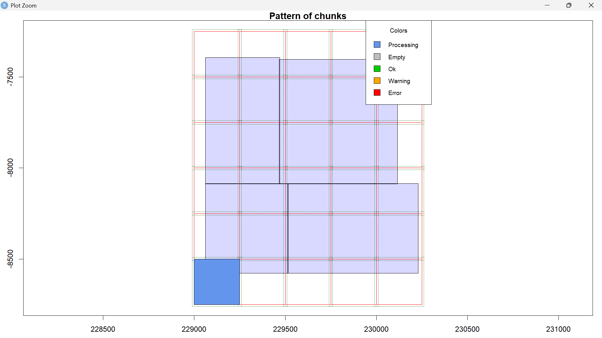
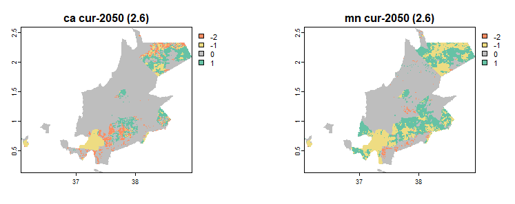

---
hide:
  - toc
  - navigation
---

# Automations

> Spatial Automations - make processes easier!. 
**Click** any card to see the _automation logic_.

**[Automated DTM & Contour Generation](terrain.md)**

An end-to-end R automated workflow designed to process _multi-chunk LiDAR point cloud_ datasets. The pipeline systematically **batch-filters ground returns** (Class 2), **generates 1-meter DTMs** (Digital Terrain Models) via _Triangulated Irregular Networks (TIN)_, _normalizes elevation datums_ across the Area of Interest (AOI), and extracts _seamless_, _publication-ready_ vector contour layers.

`R programming` `ArcGIS Pro` `QGIS`

[View Project →](terrain.md){ .md-button }

**[Web scraping](scraper.md)**

Predicting the expansion of invasive flora is critical for safeguarding agricultural ecosystems and guiding targeted control measures. This project modeled the spatial distribution and projected spread of _Acacia reficiens_ and _Opuntia_ (Cactus) across climate scenarios (RCP 2.6 and RCP 8.5). Utilizing BIOMOD2, the pipeline evaluated multiple species distribution algorithms, selecting the top three performing models to assess environmental predictors across three feature sets: bioclimatic variables, biophysical variables, and a combined bio-climatic/biophysical ensemble. 

`R` `ArcGIS Pro` `QGIS`

[View Project →](scraper.md){ .md-button }

