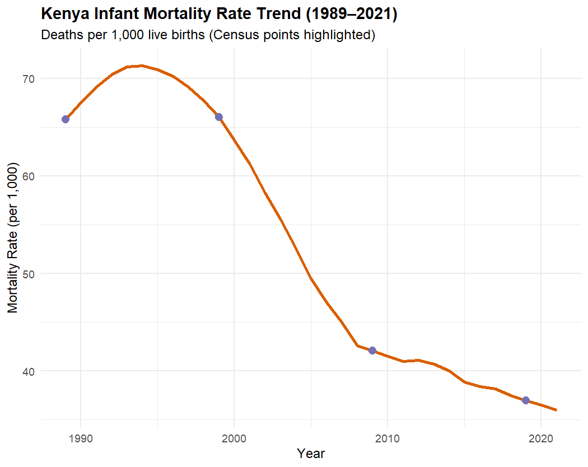

---
hide:
  - toc
  - navigation
---

# Automations

> Spatial Automations - make processes easier!. 
**Click** any card to see the _automation logic_.

**[Automated DTM & Contour Generation](terrain.md)**

This **automated geospatial pipeline** addresses the _key challenges_ of processing large-scale, LiDAR point cloud datasets. By replacing manual, tile-by-tile GIS processing with a _scripted R workflow_, the pipeline systematically extracts ground classification then executes DTM generation, datum normalization, and seamless contour extraction. The resulting workflow eliminates tile boundary artifacts, enforces strict datum consistency, and **accelerates turnaround times** from hours to minutes, delivering _standardized_, _OGC-compliant_ GeoPackages and _web-ready_ interactive deliverables tailored for varied use cases such as infrastructure planning and flood risk assessment.

`R programming` `ArcGIS Pro` `QGIS`

[View Automation →](terrain.md){ .md-button }

**[Web scraping](scraper.md)**

Tracking _multi-decadal demographic shifts_ is essential for understanding **national population dynamics** and _establishing accurate baselines for future spatial allocation models_. This automated data extraction and analytics pipeline _programmatically interfaces_ with the World Bank Open Data API to collect, transform, and evaluate 30+ years of demographic time-series data for Kenya (1989–2021). Designed as a **foundational ingestion engine**, the resulting pipeline establishes a standardized data baseline structured to integrate seamlessly into sub-national spatial join workflows across Kenya’s administrative boundaries.

`R` `ArcGIS Pro` `QGIS`

[View Automation →](scraper.md){ .md-button }

