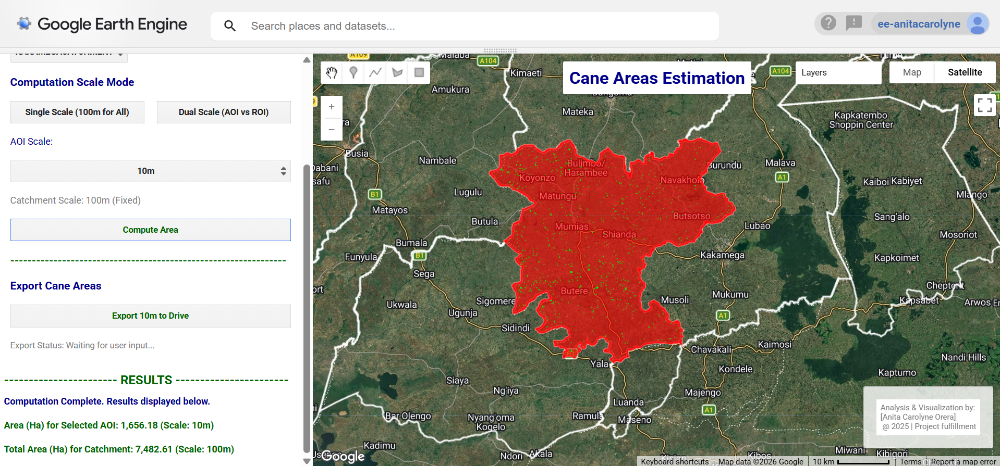

# Invasive Species Mapping - Laikipia & Isiolo


## 📌 Executive Summary

To assess regional agricultural vulnerability, this study modeled the current and future distribution of two invasive plant species _Acacia reficiens_ and _Opuntia spp._ under RCP 2.6 and RCP 8.5 climate scenarios. Built within the BIOMOD2 ensemble framework, candidate machine learning algorithms were evaluated to identify the top three performing models. The workflow systematically tested predictive performance using bioclimatic variables, biophysical factors, and a combined dataset to evaluate environmental drivers of spread.

**Study Area:** Laikipia & Isiolo
**Duration:** _November 2023 – January 2024_ 
**Role:** Geospatial Analyst - _Researcher & Developer_  
**Status:** Completed 

---

## 🛠️ Key Technical Highlights:
1. **Dynamic World Crop Masking:** Restricts spatial clustering specifically to active crop pixels (`label == 4`), eliminating urban and natural vegetation false positives.
2. **Multi-Spectral Index Stacking:** Combines 11 indices including chlorophyll-sensitive Red-Edge (`NDRE`), moisture-sensitive (`NDMI`), and soil-adjusted canopy metrics (`MSAVI`, `LAI`).
3. **Spectral Matching Strategy:** Extracts the dominant cluster overlapping known historical sugarcane plots (`caneFarms`) using modal regional reduction.
4. **Asynchronous UI Area Reduction:** Implements non-blocking client-side asynchronous JavaScript evaluation (`evaluate()`) for seamless map interactions without client-server locking.

---

## 💻 Earth Engine Workflow & Code Breakdown

Below is the complete, execution-ready Earth Engine JavaScript code structured into functional blocks.

### Step 1: Pre-Processing & Index Generation

We ingest Sentinel-2 Surface Reflectance data, apply cloud masking based on the Scene Classification Layer (`SCL`), and generate an array of multi-spectral indices tailored for canopy canopy density and water content analysis.

```javascript
/**
 * Sentinel-2 Processing & Index Calculation Module
 */
var s2 = ee.ImageCollection("COPERNICUS/S2_SR_HARMONIZED");
var dw = ee.ImageCollection('GOOGLE/DYNAMICWORLD/V1');

// Cloud Masking Function utilizing SCL band
function maskS2clouds(image) {
  var scl = image.select('SCL');
  var mask = scl.neq(3).and(scl.neq(8)).and(scl.neq(9)).and(scl.neq(10));
  return image.updateMask(mask);
}

// Stacking 11 Spectral Indices
function addVegetationIndices(image) {
  var nir = image.select('B8').divide(10000);
  var red = image.select('B4').divide(10000);
  var green = image.select('B3').divide(10000);
  var blue = image.select('B2').divide(10000);
  var redEdge = image.select('B5').divide(10000);
  var swir = image.select('B11').divide(10000);
  
  var ndvi = nir.subtract(red).divide(nir.add(red)).rename('NDVI');
  var gcvi = nir.divide(green).subtract(1).rename('GCVI');
  var gndvi = nir.subtract(green).divide(nir.add(green)).rename('GNDVI');
  var ndre = nir.subtract(redEdge).divide(nir.add(redEdge)).rename('NDRE');
  var vari = green.subtract(red).divide(green.add(red).subtract(blue)).rename('VARI');
  var savi = nir.subtract(red).multiply(1.5).divide(nir.add(red).add(0.5)).rename('SAVI');
  var msavi = nir.multiply(2).add(1).subtract(nir.multiply(2).add(1).pow(2).subtract(nir.subtract(red).multiply(8)).sqrt()).divide(2).rename('MSAVI');
  var ndmi = nir.subtract(swir).divide(nir.add(swir)).rename('NDMI');
  var evi = nir.subtract(red).multiply(2.5).divide(nir.add(red.multiply(6)).subtract(blue.multiply(7.5)).add(1)).rename('EVI');
  var lai = evi.multiply(3.618).subtract(0.118).rename('LAI').max(0).min(7);
  var mndwi = green.subtract(swir).divide(green.add(swir)).rename('MNDWI');
  
  return image.addBands([ndvi, gcvi, evi, gndvi, ndre, vari, savi, msavi, ndmi, lai, mndwi]);
}
```
### Step 2: Crop-Masked K-Means Clustering & Spectral Matching

We mask out non-agricultural areas using Dynamic World land cover metrics, sample the remaining pixels across Western Kenya, and apply Weka K-Means clustering.

```javascript
// Dynamic World Crop Filter (Label 4 = Crops)
var dwModeImage = dw.filterDate('2025-09-10', '2025-10-31')
                    .filterBounds(entireAOI)
                    .select('label')
                    .reduce(ee.Reducer.mode())
                    .clip(entireAOI);
var cropsMask = dwModeImage.eq(4).selfMask();

// Perform Unsupervised K-Means Clustering
var indices = ['NDVI', 'GCVI', 'EVI', 'GNDVI', 'NDRE', 'VARI', 'SAVI', 'MSAVI', 'NDMI', 'LAI', 'MNDWI'];
var maskedImage = medianImage.select(indices).updateMask(cropsMask);

var training = maskedImage.sample({
  region: entireAOI,
  scale: 100, 
  numPixels: 10000, 
  seed: 0,
  tileScale: 16
});

var clusterer = ee.Clusterer.wekaKMeans(12).train(training);
var clusteredImage = maskedImage.cluster(clusterer).rename('unsupervisedClusters');

// Mode reduction to extract the cluster ID matching verified cane farm plots
var caneStats = medianImage.select(indices)
                           .addBands(clusteredImage)
                           .select('unsupervisedClusters')
                           .reduceRegion({
                             reducer: ee.Reducer.mode(),
                             geometry: caneFarms,
                             scale: 100, 
                             maxPixels: 1e13
                           });

var caneClusterID = caneStats.get('unsupervisedClusters');
var extractedCane = clusteredImage.eq(ee.Image.constant(caneClusterID));
var finalCaneAreas = extractedCane.updateMask(extractedCane.eq(1));
```

### Step 3: Reactive UI Controller & Non-Blocking Area Reductions

The interactive GUI allows users to select catchments and sub-counties, set variable spatial resolution scales (10m vs 100m), and trigger client-side evaluation without blocking the map UI thread.

```javascript
// Asynchronous calculation function bound to GUI compute trigger
function calculateAndDisplay() {
  if (!selectedAOI || !selectedCatchmentFC) {
    instructionsLabel.setValue('ERROR: Please complete steps 1 and 2.');
    return;
  }
  
  var aoiScale = (scaleMode === 'single') ? 100 : parseInt(aoiScaleSelect.getValue().replace('m', ''), 10);
  var catchmentScale = 100;
  
  instructionsLabel.setValue('Computing areas... (AOI: ' + aoiScale + 'm, Catchment: ' + catchmentScale + 'm)');
  
  // Calculate area reductions server-side
  var aoiArea = areaImageHa.reduceRegion({
    reducer: ee.Reducer.sum(),
    geometry: selectedAOI.geometry(),
    scale: aoiScale,
    maxPixels: 1e13
  }).get('area_ha');
  
  var catchmentArea = areaImageHa.reduceRegion({
    reducer: ee.Reducer.sum(),
    geometry: selectedCatchmentFC.geometry(),
    scale: catchmentScale,
    maxPixels: 1e13
  }).get('area_ha');
  
  // Non-blocking Client-Side Evaluation Callback
  var callback = function(results) {
    var rawAoi = results[0] || 0;
    var rawCatchment = results[1] || 0;
    
    var computedAOIArea = (Math.round(rawAoi * 100) / 100).toLocaleString();
    var computedCatchmentArea = (Math.round(rawCatchment * 100) / 100).toLocaleString();
    
    aoiAreaLabel.setValue('Area (Ha) for Selected AOI: ' + computedAOIArea + ' (Scale: ' + aoiScale + 'm)');
    catchmentAreaLabel.setValue('Total Area (Ha) for Catchment: ' + computedCatchmentArea + ' (Scale: ' + catchmentScale + 'm)');
    instructionsLabel.setValue('Computation Complete.');
  };
  
  // Send server request asynchronously
  ee.List([aoiArea, catchmentArea]).evaluate(callback);
}
```

---

## 📊 Interactive Interface & Results Visualizer

> When executed in GEE, the web interface embeds custom UI controls on the left panel, updating the spatial layers and area metrics on-the-fly:



---

## --- Summarized Logic steps

1. Load pre-processed data into QGIS to confirm extents with a basemap overaly
2. Digitize farm boundaries
3. Check for errors and/or inconsistencies
4. Export cleaned data (with appropriate naming structure) as shapefiles
5. Load data into GEE, defining time period and extents
6. Filter and pre-process data
7. Compute relevant indices
8. Perform supervised classification (DW) & Unsupervised classification (clusters)
9. Develop UI with interactive elements for dynamic computations

---

## --- Tools Used

| Tool | Purpose |
|------|---------|
| QGIS  | Initial loading & cleaning |
| ArcGIS Pro | Digitization  |
| Google Earth Engine | Pre-processing, Analysis & Visualization |

---

## 📈 Impact & Applications

1. **Dynamic Decision Support**: Enables rapid estimation of sugarcane biomass across individual supply zones (outgrower schemes) versus factory catchment baselines.

2. **Scalable GIS Infrastructure**: The approach complements manual digitizing with automated, multi-spectral cloud computing capable of processing multi-gigabyte satellite scenes in seconds.

3. **Export Readiness**: Integrates direct 10m resolution GeoTIFF exports to Google Drive for offline downstream GIS modeling in QGIS or ArcGIS Pro.

---

## Links

[View User Interface on Earth Engine](https://code.earthengine.google.com/bcc9fdcc4a53e8438de4e1533002d2b3){ .md-button }
[View Code on GitHub](https://anita-carolyne.github.io/Anita-Carolyne/){ .md-button }

