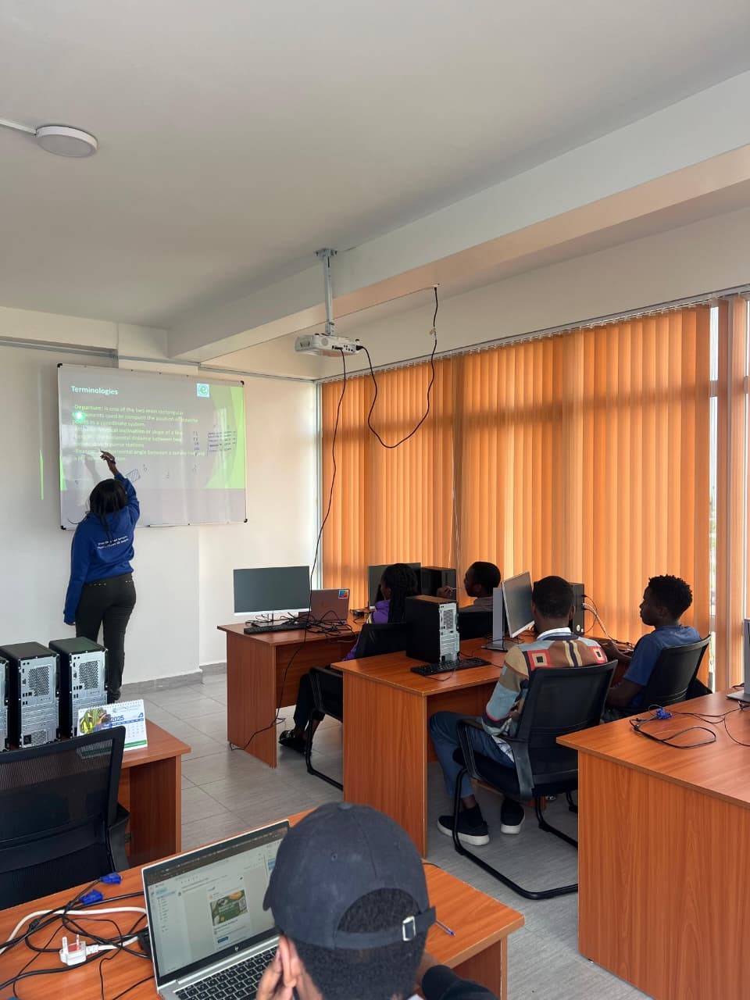

---
hide:
  - toc
  - navigation
---
<!--
CHECKLIST FOR THIS PAGE:
- [ ] Edit the skill cards to match your actual skills (add, remove, or rename cards as needed)
-->

  <!-- Group 1: The Image + Halo -->
  

    
  

  <!-- Group 2: The Text -->
  

    <h1>ANITA CAROLYNE</h1>
    

      <strong></strong>
    

    
<em>Bridging the gap between data, Geospatial technologies & AI</em>

  

---

## About Me

I am a Geospatial Analyst With a solid background in Geomatics Engineering and GIS having **3+ years** of experience, driving impactful solutions in ***geospatial data analysis and GeoAI***. 
I work on extracting actionable insights from satellite imagery and large spatial datasets using ***Google Earth Engine***, ***R***, _Python_ and _open-source GIS tools_.
I am passionate about applying GeoAI techniques to _real-world challenges_ in land use mapping, climate monitoring, and urban planning.

  

---

[View My Projects :material-arrow-right:](projects/index.md){ .md-button .md-button--primary }
[Download CV :material-download:](assets/Anita-CV.pdf){ .md-button }

---

## Skills

-   :material-layers:{ .lg .middle } **GIS & Remote Sensing**

    ---

    -  **Google Earth Engine**
    -  **QGIS**
    -  **ArcGIS Pro**
    - :material-satellite-variant: **ERDAS Imagine**
    - :material-image-filter-hdr: **Multispectral image analysis**

-   :material-code-braces:{ .lg .middle } **Programming & Scripting**

    ---

    -  **R** — sf, terra, ggplot2
    -  **Python** — GeoPandas, NumPy, Pandas, Matplotlib
    -  **JavaScript** — Leaflet
    -  **SQL** — PostgreSQL + PostGIS

-   :material-star-four-points:{ .lg .middle } **Machine Learning & GeoAI**

    ---

    -  **scikit-learn** — Random Forest, SVM, XGBoost
    -  **PyTorch** &  **TensorFlow**
    - :material-brain: **Deep learning** — U-Net, SAM
    - :material-radar: **Object detection in satellite imagery**

-   :material-earth:{ .lg .middle } **Web Mapping & Visualization**

    ---

    -  **Leaflet.js** & **Folium**
    -  **Streamlit** for data apps
    - :material-code-json: **Data formats** — GeoTIFF, NetCDF, GeoJSON

-   :material-database:{ .lg .middle } **Data & Cloud**

    ---

    -  **PostgreSQL** + **PostGIS**
    -  **AWS S3**
    -  **Google Cloud Storage**

---

## Connect

[GitHub](https://github.com/Anita-Carolyne){ .md-button }
[LinkedIn](https://linkedin.com/in/anita-carolyne-orera/){ .md-button }
