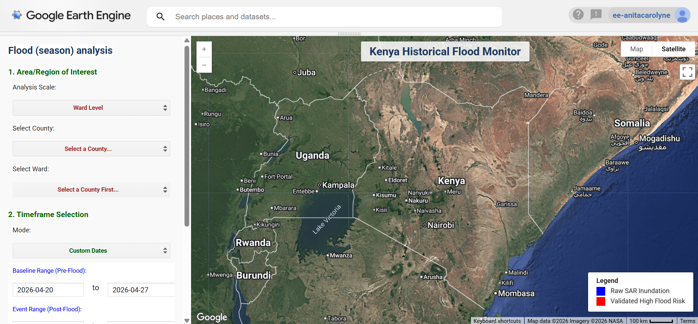
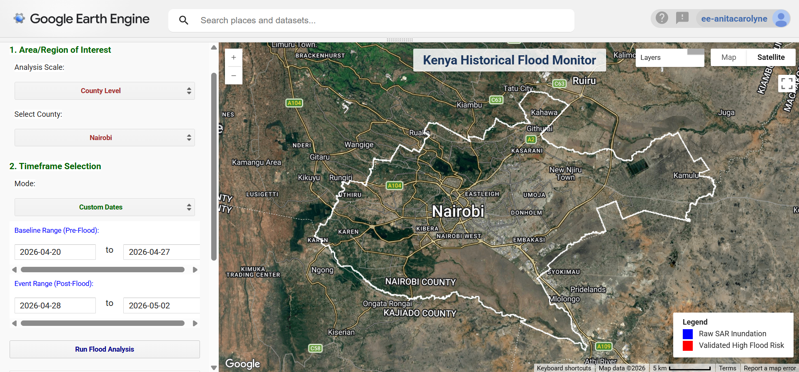
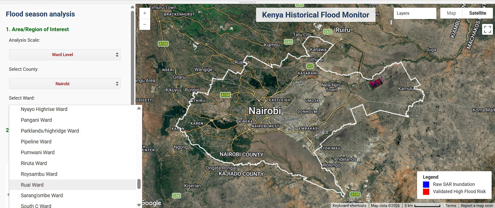
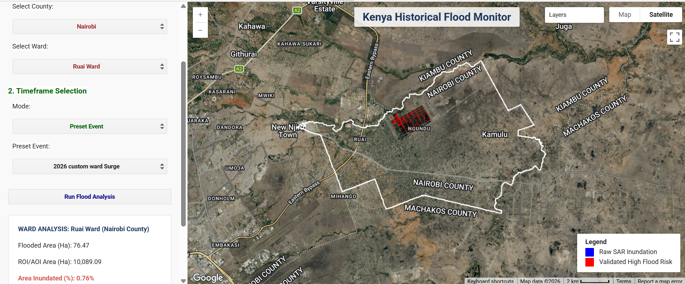

# Flood Monitoring (_A historical and sesonal approach_)



## 📌 Executive Summary

The Kenya Multi-Year & Custom Flood Monitor is an interactive Google Earth Engine (GEE) web application engineered for rapid spatial inundation assessment across Kenyan administrative boundaries (County and Ward levels). The core analytical workflow combines Synthetic Aperture Radar (SAR) backscatter analysis with digital elevation model (DEM) terrain constraints to isolate true flood inundation from permanent water bodies and low-backscatter urban artifacts. 
> Users can run flood comparisons across custom periods, dynamically visualize different administrative levels, and export results directly.

**Study Area:** Kenya
**Purpose:** _Research and Development_  
**Status:** In progress 

---

## 🛠️ Key Technical Highlights:
* **Dual Spatial Scale:** Flexibility to run macroeconomic assessments at the County level or granular localized evaluations at the Ward level.



* **Weather-Independent Sensing:** By leveraging Sentinel-1 radar imagery, the tool pierces through cloud cover during extreme rainstorms—a major limitation of optical satellite sensors during active flood events.

* **Automated Risk Validation:** Combines satellite radar data with ground topography to ensure reported flood zones reflect actual physical risk rather than satellite noise.

* **GIS Ready:** Directly connects satellite analytics to downstream GIS tools like QGIS and ArcGIS by providing automated exports of GeoTIFF rasters and Shapefile vectors.

---

## Data Pipelines & Processing Workflow
1. **SAR Inundation Detection:** Utilizes Sentinel-1 Ground Range Detected (GRD) C-band imagery (Interferometric Wide mode) acquired in dual-polarization. 
> Synthetic aperture backscatter thresholds define surface water presence across pre- and post-event temporal windows to map change detection over time.
2. **Topographic Vulnerability Refinement:** Integrates 30-meter USGS SRTM elevation data to calculate local slope gradients and lower 20th percentile elevation thresholds. 
> This terrain mask eliminates backscatter noise over flat, smooth non-water surfaces (e.g., asphalt, runways) and restricts false positives to topographically vulnerable lowlands.
3. **Spatial Aggregation & Area Analytics:** Exact flooded surface area is computed at 10-meter pixel resolution using ee.Image.pixelArea(). 
> Results are aggregated across the targeted geometry vector boundary using reduceRegion reducers and formatted asynchronously for dynamic UI updates.

4. **User Interface & Output Generation:** Features asynchronous, non-blocking cascading dropdowns driven by .evaluate() callback chains to query feature collections dynamically.

---

## 💻 Earth Engine Workflow & Code Breakdown

Below are snippets of the Engine JavaScript code structured into functional blocks.

### 1: Pre-requisites

This step entails loading necessary data and performing necessary pre-processing.

```javascript
// Load data
// Pre-process data
```

### 2: Establish the core computation engine

The core processing engine extracts pre- and post-event backscatter medians from Sentinel-1 Ground Range Detected (GRD) scenes in Interferometric Wide (IW) mode.
> Dual-Pol SAR & Vulnerability Modeling

```javascript
// Extract surface inundation using VV and VH backscatter thresholds
var beforeWater = before.select('VV').lt(-17).and(before.select('VH').lt(-20));
var afterWater  = after.select('VV').lt(-17).and(after.select('VH').lt(-20));

// Raw Flood Hazard: Water detected post-event that was not present pre-event
var rawFloodHazard = afterWater.and(beforeWater.not());

// Terrain Vulnerability: SRTM 30m DEM slope (< 1.5°) & bottom 20th percentile elevation
var dem = ee.Image('USGS/SRTMGL1_003').clip(targetGeometry);
var lowAreasMask = dem.lt(ee.Number(dem.reduceRegion({
  reducer: ee.Reducer.percentile([20]),
  geometry: targetGeometry,
  scale: 30
}).get('elevation')));

var flatAreas = ee.Terrain.slope(dem).lt(1.5);
var localVulnerability = lowAreasMask.or(flatAreas);

// Final Validated Flood Risk Layer
var finalFloodRisk = hazardAligned.and(localVulnerability).clip(targetGeometry);

```

### 3: Metric Calculations & Formatting

Area calculations compute the total inundated footprint in square meters and hectares.

```javascript
function calculateFloodMetrics(floodMask, targetGeometry) {
  var areaImage = floodMask.gt(0).multiply(ee.Image.pixelArea()).rename('flooded_sqm');
  var stats = areaImage.reduceRegion({
    reducer: ee.Reducer.sum(),
    geometry: targetGeometry,
    scale: 10,
    maxPixels: 1e13
  });

  var safeSqm = ee.Number(ee.Algorithms.If(stats.get('flooded_sqm'), stats.get('flooded_sqm'), 0));
  var floodedAreaHectares = safeSqm.divide(10000);
  var totalRegionHectares = targetGeometry.area({maxError: 1}).divide(10000);
  var percentFlooded = safeSqm.divide(targetGeometry.area({maxError: 1})).multiply(100);

  return {
    floodedHectares: floodedAreaHectares.format('%,.2f'),
    totalHectares: totalRegionHectares.format('%,.2f'),
    percentFlooded: percentFlooded.format('%.2f')
  };
}

```

### 4: Cascading Asynchronous UI Logic

To avoid blocking the interface during asset evaluation, county and ward attributes are queried asynchronously using .evaluate(). 
> Selecting a county automatically populates its corresponding wards.

```javascript
// Load Wards dynamically based on active County selection
countySelect.onChange(function(selectedCounty) {
  wardSelect.setValue(null, false);
  wardSelect.setDisabled(true);
  wardSelect.setPlaceholder('Loading Wards for ' + selectedCounty + '...');

  var filteredWards = wardsBoundary.filter(ee.Filter.eq('county', selectedCounty));
  
  filteredWards.aggregate_array('ward').distinct().sort().evaluate(function(wards) {
    wardSelect.items().reset(wards);
    wardSelect.setPlaceholder('Select a Ward...');
    wardSelect.setDisabled(false);
  });
});
 
```

---

## 📊 Interactive Interface & Results Visualizer
Users can initiate export tasks to Google Drive directly from the UI panel.
> When executed in GEE, the web interface embeds custom UI controls on the left panel, updating the spatial layers and area metrics on-the-fly. 



```javascript
// Export High-Risk Inundation Vector as Shapefile
Export.table.toDrive({
  collection: currentFloodResult.reduceToVectors({
    geometry: currentAOI,
    crs: 'EPSG:4326',
    scale: 30,
    geometryType: 'polygon',
    labelProperty: 'flood_risk'
  }),
  description: currentExportName + '_Vectors',
  folder: 'GEE_Flood_Exports',
  fileFormat: 'SHP'
});

```

---

## --- Summarized Logic steps

1. **Boundary & Temporal Selection:** Dynamic UI filters administrative boundaries (_County/Ward level_) and sets pre- (_baseline_) and post-event temporal ranges.
2. **Sentinel-1 SAR Filtering:** Sentinel-1 GRD imagery (_IW mode, 10m scale_) is fetched for both timeframes, filtering for _co-polarization (VV)_ and _cross-polarization (VH)_ backscatter.
3. **Dual-Pol Water Surface Detection:** Inundation masks are extracted using dual-polarization thresholding.
4. **Change Detection (_Raw Hazard_):** Post-flood water masks are _cross-referenced_ with pre-flood baselines to _isolate newly inundated surface areas_ from _permanent bodies_ of water
5. **Topographic Vulnerability Refinement:** A _30m USGS SRTM DEM_ screens out false positives (e.g., _asphalt/smooth surfaces_) by retaining only areas with low slopes or within the bottom 20th elevation percentile of the target AOI.
6. **Metric Computation & Export:** Inundated surface area (_hectares and percentage cover_) is computed asynchronously and formatted for dynamic UI output and direct GIS exports.

---

## --- Tools Used

| Tool | Purpose |
|------|---------|
| Google Earth Engine | Pre-processing, Analysis & Visualization |

---

## Primary Use Cases

1. **Rapid Disaster Response:** Operational mapping of emergency flood extents during heavy rain events (e.g., _MAM Long Rains_) when cloud cover prevents optical satellite imaging.

2. **Localized Damage Assessment:** Ward-level spatial evaluations to identify inundated critical infrastructure, residential zones, and agricultural fields.

3. **Baseline Risk Profiling:** Historical flood footprint analysis to map _recurrent_ inundation hotspots and validate flood risk models.

---

## 📈 Impact & Applications

1. **Cloud-Penetrating Disaster Intelligence:** Leverages C-band radar to penetrate dense storm clouds, delivering actionable spatial data when optical satellites fail.

2. **Granular Resource Allocation:** Enables emergency responders and humanitarian aid teams to prioritize specific wards for targeted rescue and relief operations.

3. **Automated GIS Integration:** Accelerates downstream reporting by providing automated, vector-ready spatial datasets directly to local planning agencies and decision-makers.

---

> Disclaimer: For a more accurate assessment, VHR satellite data or data obtained from KMD (Kenya Meteorological Department) is needed to accurately quantify flood behavior and impact.

## Links

[Go to User Interface](https://ee-anitacarolyne.projects.earthengine.app/view/flood-monitor){ .md-button }
[View Code on GitHub](https://anita-carolyne.github.io/Anita-Carolyne/){ .md-button }
