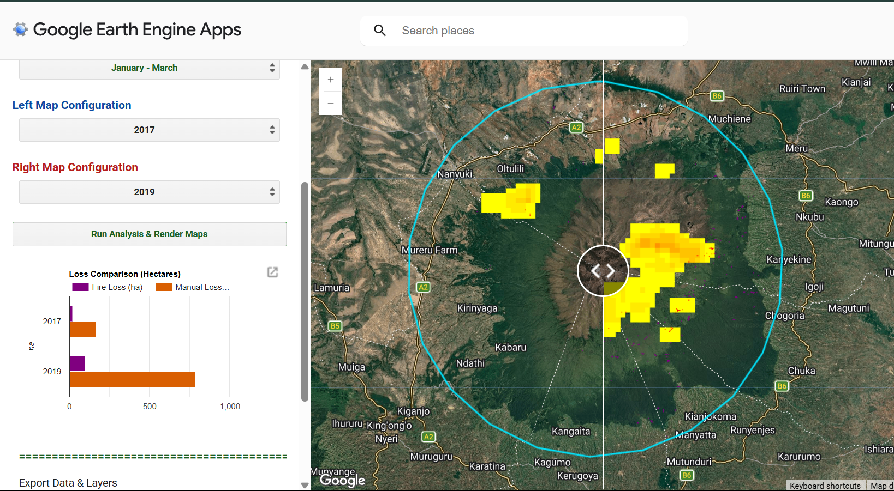

# Seasonal Forest Loss & Driver Attribution


## 📌 Executive Summary

Built on **Google Earth Engine**, this web application _quantifies seasonal canopy loss_ and _identifies disturbance drivers_ within customizable spatial buffers around Mount Kenya. 
The workflow pairs Dynamic World’s _10m probability bands_ with _Sentinel-3/MODIS thermal anomalies_ to isolate fire impact from land clearing. 
> Users can run dual-map spatial comparisons across custom periods, dynamically visualize zonal loss statistics, and export analysis-ready GeoTIFF rasters and CSV reports directly.

**Study Area:** Mount Kenya Ecosystem
**Target Years:** _2012 – 2023_ 
**Purpose:** _Research and Development_  
**Status:** Completed 

---

## 🛠️ Key Technical Highlights:
1. **Multi-Source Data Integration:** Pairs Sentinel-2-derived 10m Dynamic World land cover probability bands with NASA FIRMS thermal anomaly data to isolate canopy loss and map spatial drivers.
2. **Algorithmic Driver Attribution:** Implements a dual-condition spatial overlay algorithm to automatically classify total forest loss into distinct driver categories.
3. **Dynamic Zonal Statistics Engine:** On-the-fly spatial reduction (reduceRegion) calculates precise areal loss statistics in hectares based on user-defined buffer radiuses around the study area.
4. **Synchronized Multi-Temporal UI:** Custom split-panel architecture enables side-by-side comparative visualization across variable years and seasonal windows.
5. **Automated Reporting & Export Pipeline:** Built-in event handlers directly generate downloadable CSV summary tables and multi-band GeoTIFF spatial rasters for offline geospatial workflows.

---

## 💻 Earth Engine Workflow & Code Breakdown

Below are snippets of the Engine JavaScript code structured into functional blocks.

### Step 1: Pre-requisites

We first load our necessary datasets and establish visualization parameters.

```javascript
// =========================================================================
// Load Datasets, Establish the default geometry setup and Palettes
// =========================================================================
// Mount Kenya Peak Point (37.3083° E, 0.1521° S)
var mtKenyaPoint = ee.Geometry.Point([37.3083, -0.1521]);

var firmsCol = ee.ImageCollection("FIRMS");
var dwCol = ee.ImageCollection("GOOGLE/DYNAMICWORLD/V1");

// Visualization Palettes
var lossVis = {min: 1, max: 1, palette: ['red']};
var fireVis = {min: 1, max: 10, palette: ['yellow', 'orange', 'red']};
var manualVis = {min: 1, max: 1, palette: ['purple']};

```

### Step 2: Establish the core computation engine

Develop the core computation engine, defining all relevant functions and parameters.

```javascript
// =========================================================================
// Define your Core computation Engine
// =========================================================================
// 1. Create the buffer
// 2. Choose seasons (month range)
// 3. Etablish DW thresholds for before and after tree cover
// 4. Manipulate FIRMS data
```

### Step 3: Reactive UI & Export functionality

The interactive GUI allows users to select the buffer distance, season and comparison years. It then allows export of the data and loaded layers

```javascript
// Code snippet of loaded layers on Split-Panel UI
// --- ADD LAYERS TO LEFT MAP ---
  leftMap.addLayer(leftData.select('fire_count').selfMask(), fireVis, leftYear + ' Fire Count');
  leftMap.addLayer(leftData.select('fire_driven_loss'), lossVis, leftYear + ' Fire Loss');
  leftMap.addLayer(leftData.select('manual_clearing_loss'), manualVis, leftYear + ' Manual Loss');
  leftMap.addLayer(styledRoi, {}, 'ROI Buffer');

  // --- ADD LAYERS TO RIGHT MAP ---
  rightMap.addLayer(rightData.select('fire_count').selfMask(), fireVis, rightYear + ' Fire Count');
  rightMap.addLayer(rightData.select('fire_driven_loss'), lossVis, rightYear + ' Fire Loss');
  rightMap.addLayer(rightData.select('manual_clearing_loss'), manualVis, rightYear + ' Manual Loss');
  rightMap.addLayer(styledRoi, {}, 'ROI Buffer');
```

---

## 📊 Interactive Interface & Results Visualizer

> When executed in GEE, the web interface embeds custom UI controls on the left panel, updating the spatial layers and area metrics on-the-fly. 



---

## --- Summarized Logic steps

1. Data Ingestion & Filtering
> Load Sentinel-2 Dynamic World land cover probabilities and NASA FIRMS active fire datasets filtered by chosen seasonal date ranges.
2. Buffer & ROI Definition
> Buffer the target study area geometry based on your area of interest to establish the analytical boundary.
3. Canopy Loss Detection
> Identify pixels where forest probability drops below the defined baseline threshold between starting and ending timeframes.
4. Driver Classification
>Mask loss pixels intersecting FIRMS thermal anomalies as Fire-Driven Loss, classifying all non-intersecting loss pixels as Manual Clearing.
5. Spatial Reduction
> Compute zonal area statistics (`reduceRegion`) to calculate net hectare loss per driver category inside the buffer.
6. UI Rendering & Export
> Render styled raster overlays on the synchronized split-map and populate download links for CSV summary statistics and GeoTIFFs.

---

## --- Tools Used

| Tool | Purpose |
|------|---------|
| Google Earth Engine | Pre-processing, Analysis & Visualization |

---

## Primary Use Cases

1. **Routine Catchment Auditing:** Environmental agencies and conservation NGOs can execute _seasonal_ or _annual audits_ to track canopy health trends across specific forest blocks or community reserves.
2. **Post-Fire Damage & Clearance Assessments:** Disaster management units can _isolate wildfire scars_ from _clear-cutting_ to quantify burn severity, calculate total damaged hectares, and map recovery trajectories.
3. **Stakeholder Reporting & Open Access Data:** Researchers, decision-makers, and field teams can _instantly generate standardized CSV summary tables_ and download aligned spatial GeoTIFFs for further spatial analysis.

---

## 📈 Impact & Applications

1. **Targeted Conservation & Rapid Enforcement:** Distinguishing _active wildfire fronts_ from anthropogenic land clearing equips agency wardens (such as KFS and KWS) with actionable intelligence to _deploy targeted rapid-response teams_, _fight active blazes_, or _halt illegal logging operations_ in high-risk buffer zones.
2. **Protecting Water Tower Ecosystem Services:** As one of Kenya’s primary montane water towers, _safeguarding the Mount Kenya catchment_ directly maintains downstream hydrological regulation, reducing reservoir siltation for hydroelectric power and sustaining agricultural water security.
3. **Data-Driven Restoration & Policy:** Automated zonal reports provide _empirical metrics_ to guide _reforestation initiatives_, _evaluate community forest management (CFA) interventions_, and fulfill _international reporting obligations_ under frameworks like REDD+ and AFR100.

---

> Disclaimer: For a more accurate assessment, field collected data or organizational data (e.g. from KFS) is needed to accurately quantify burn area and forest losses.

## Links

[Go to User Interface](https://ee-anitacarolyne.projects.earthengine.app/view/forest-disturbance){ .md-button }
[View Code on GitHub](https://anita-carolyne.github.io/Anita-Carolyne/){ .md-button }
