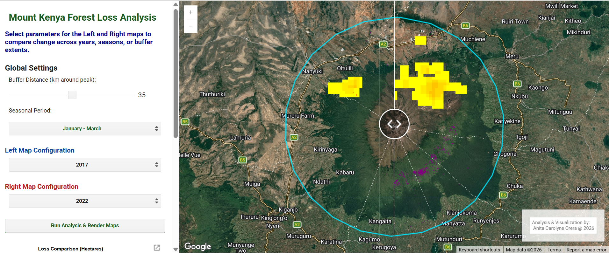

# Projects

> My Geospatial projects at a glance. 
**Click** any card to see the _full write-up_.

**[Forest Loss & Driver Attribution](forestDisturbance.md)**

Monitoring forest disturbance in tropical montane ecosystems is critical for safeguarding water towers, informing conservation policy, and guiding targeted restoration interventions. This project quantified seasonal tree canopy loss and attributed spatial drivers - distinguishing fire-driven events from manual land clearing-around the Mount Kenya ecosystem. Integrating Google Dynamic World 10m land cover probability bands with NASA FIRMS thermal anomaly data, the automated pipeline evaluates seasonal disturbance dynamics within user-defined spatial buffers. Implemented as an interactive Earth Engine web application, the system pairs a synchronized split-panel interface for multi-temporal comparative analysis with zonal statistics extraction, offering automated generation of analysis-ready spatial rasters and structured CSV loss reports.

`Google Earth Engine`

[View Project →](forestDisturbance.md){ .md-button }

**[Automated Sugarcane Areas Estimation](caneAreasEstimation.md)**

Automating the sugarcane census workflow across key sugar zones in Kenya to monitor coverage, pre-inform yield, and harvest capacity. Designed to eliminate repetitive spatial analysis, this pipeline integrates field surveys and factory/miller datasets for robust model training and validation. 
Includes a Google Earth Engine interactive UI that calculates and maps sugarcane coverage based on user-selected parameters to streamline decision-making for industry stakeholders.

`Google Earth Engine` `ArcGIS Pro` `QGIS`

[View Project →](caneAreasEstimation.md){ .md-button }

**[Invasive Species Mapping](invasiveSpecies.md)**

Predicting the expansion of invasive flora is critical for safeguarding agricultural ecosystems and guiding targeted control measures. This project modeled the spatial distribution and projected spread of _Acacia reficiens_ and _Opuntia_ (Cactus) across climate scenarios (RCP 2.6 and RCP 8.5). Utilizing BIOMOD2, the pipeline evaluated multiple species distribution algorithms, selecting the top three performing models to assess environmental predictors across three feature sets: bioclimatic variables, biophysical variables, and a combined bio-climatic/biophysical ensemble. 

`R` `ArcGIS Pro` `QGIS`

[View Project →](invasiveSpecies.md){ .md-button }

