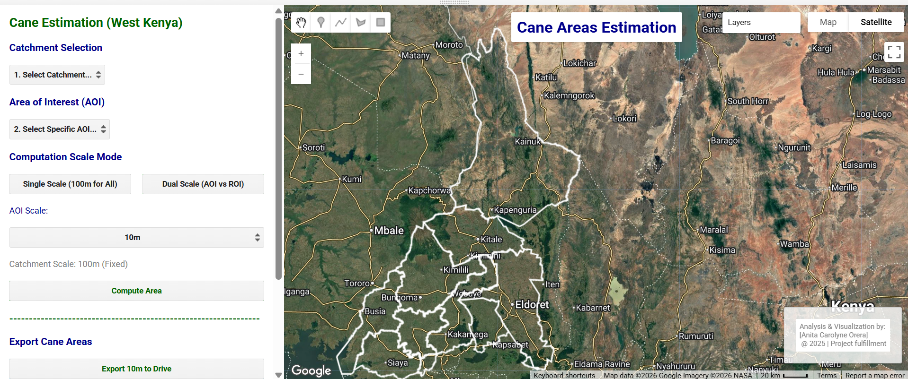

<!--
CHECKLIST (copy this file for each new project):
- [ ] Update the Key Findings section
- [ ] Update the Links section
- [ ] Add a card for this project on docs/projects/index.md
- [ ] Add a nav entry in mkdocs.yml
-->

# Sugarcane Areas Estimation - Western Kenya



## 📌 Executive Summary

Determining crop coverage across dynamic agricultural catchments requires _balancing fine spatial resolution_ for local farm blocks _with computational efficiency_ across larger administrative boundaries. 

This project implements an _unsupervised K-means classification workflow_ paired with _dynamic spectral matching_ against ground-truth cane farm geometries. The interactive user interface allows decision-makers to evaluate _area statistics_ across **Dual-Scale modes** (10m–30m local sub-county AOIs vs. 100m catchment baselines).

**Study Area:** West Kenya  
**Duration:** July 2025 – November 2025  
**Role:** Geospatial Analyst - _Team lead_  
**Status:** Completed 

---

## 🛠️ Methodology & Technical Architecture
### Key Technical Highlights:
1. **Dynamic World Crop Masking:** Restricts spatial clustering specifically to active crop pixels (`label == 4`), eliminating urban and natural vegetation false positives.
2. **Multi-Spectral Index Stacking:** Combines 11 indices including chlorophyll-sensitive Red-Edge (`NDRE`), moisture-sensitive (`NDMI`), and soil-adjusted canopy metrics (`MSAVI`, `LAI`).
3. **Spectral Matching Strategy:** Extracts the dominant cluster overlapping known historical sugarcane plots (`caneFarms`) using modal regional reduction.
4. **Asynchronous UI Area Reduction:** Implements non-blocking client-side asynchronous JavaScript evaluation (`evaluate()`) for seamless map interactions without client-server locking.

---

## 💻 Earth Engine Workflow & Code Breakdown

Below is the complete, execution-ready Earth Engine JavaScript code structured into functional blocks.

### Step 1: Pre-Processing & Index Generation

We ingest Sentinel-2 Surface Reflectance data, apply cloud masking based on the Scene Classification Layer (`SCL`), and generate an array of multi-spectral indices tailored for canopy canopy density and water content analysis.

```javascript
/**
 * Sentinel-2 Processing & Index Calculation Module
 */
var s2 = ee.ImageCollection("COPERNICUS/S2_SR_HARMONIZED");
var dw = ee.ImageCollection('GOOGLE/DYNAMICWORLD/V1');

// Cloud Masking Function utilizing SCL band
function maskS2clouds(image) {
  var scl = image.select('SCL');
  var mask = scl.neq(3).and(scl.neq(8)).and(scl.neq(9)).and(scl.neq(10));
  return image.updateMask(mask);
}

// Stacking 11 Spectral Indices
function addVegetationIndices(image) {
  var nir = image.select('B8').divide(10000);
  var red = image.select('B4').divide(10000);
  var green = image.select('B3').divide(10000);
  var blue = image.select('B2').divide(10000);
  var redEdge = image.select('B5').divide(10000);
  var swir = image.select('B11').divide(10000);
  
  var ndvi = nir.subtract(red).divide(nir.add(red)).rename('NDVI');
  var gcvi = nir.divide(green).subtract(1).rename('GCVI');
  var gndvi = nir.subtract(green).divide(nir.add(green)).rename('GNDVI');
  var ndre = nir.subtract(redEdge).divide(nir.add(redEdge)).rename('NDRE');
  var vari = green.subtract(red).divide(green.add(red).subtract(blue)).rename('VARI');
  var savi = nir.subtract(red).multiply(1.5).divide(nir.add(red).add(0.5)).rename('SAVI');
  var msavi = nir.multiply(2).add(1).subtract(nir.multiply(2).add(1).pow(2).subtract(nir.subtract(red).multiply(8)).sqrt()).divide(2).rename('MSAVI');
  var ndmi = nir.subtract(swir).divide(nir.add(swir)).rename('NDMI');
  var evi = nir.subtract(red).multiply(2.5).divide(nir.add(red.multiply(6)).subtract(blue.multiply(7.5)).add(1)).rename('EVI');
  var lai = evi.multiply(3.618).subtract(0.118).rename('LAI').max(0).min(7);
  var mndwi = green.subtract(swir).divide(green.add(swir)).rename('MNDWI');
  
  return image.addBands([ndvi, gcvi, evi, gndvi, ndre, vari, savi, msavi, ndmi, lai, mndwi]);
}
```

---

## Methods & Tools

**Data Sources**

- [Drone Datasets (DJU Mavic 3 MSS)]
- [Kenya Counties ]

**Logic Steps**

1. Load pre-processed data into QGIS to confirm extents with a basemap overaly
2. Digitize farm boundaries
3. Check for errors and/or inconsistencies
4. Export cleaned data (with appropriate naming structure) as shapefiles
5. Load data into GEE, defining time period and extents
6. Filter and pre-process data
7. Compute relevant indices
8. Perform supervised classification (DW) & Unsupervised classification (clusters)
9. Develop UI with interactive elements for dynamic computations

**Tools Used**

| Tool | Purpose |
|------|---------|
| QGIS  | Initial loading & cleaning |
| ArcGIS Pro | Digitization  |
| Google Earth Engine | Pre-processing, Analysis & Visualization |

---
## Key Findings

- Finding one — include a number or metric if possible
- Finding two
- Finding three

---

## Links

[View User Interface on Earth Engine](https://code.earthengine.google.com/bcc9fdcc4a53e8438de4e1533002d2b3){ .md-button }
[View Code on GitHub](https://anita-carolyne.github.io/Anita-Carolyne/){ .md-button }

